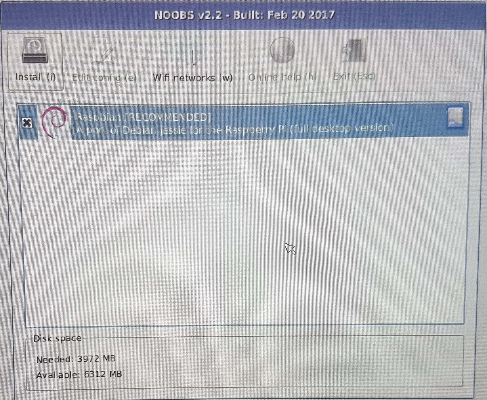
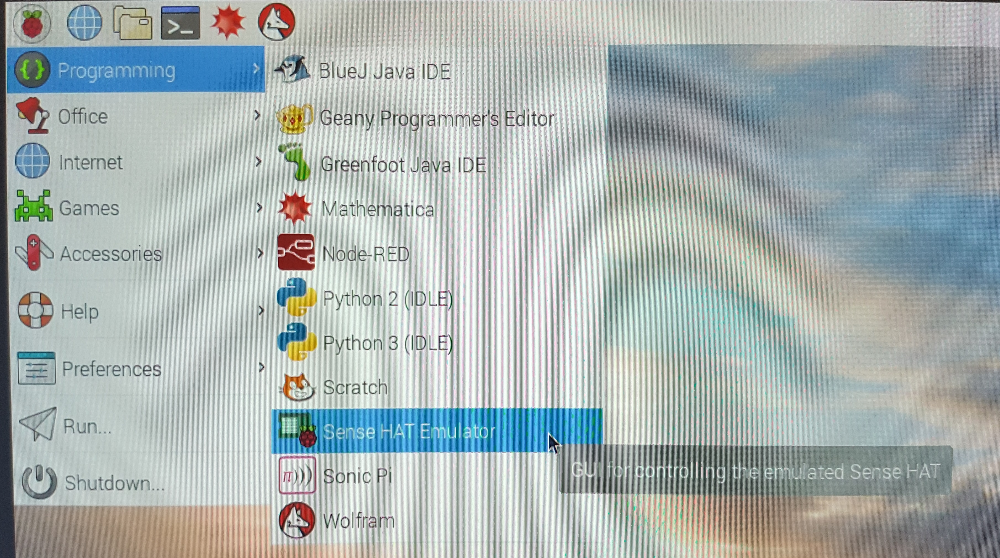
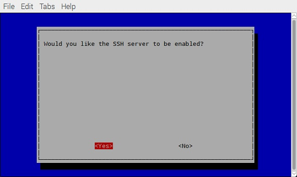

## Advance Setup (Must be completed in advance of the HOL)

Please perform the following steps in advance of the HOL otherwise you will waste the entire HOL performing these steps.

1. Ensure your Raspberry Pi can boot [Raspian] (https://www.raspberrypi.org/downloads/) from the SD card.
  - Install the operating system installer [NOOBS] (https://www.raspberrypi.org/downloads/noobs/) 
  - Format the microSD card that you will use for your Raspberry Pi. 
  - Extract the files in the NOOBs zip file. 
  - Copy the extracted files onto the formatted microSD card such that the files are at the root directory of the microSD card. 
  - Insert the microSD card into your Pi and connect the power supply. 
  - Click to install Raspbian
     <p align="center">
        
      </p>
  - Confirm the deletion of content on the SD card and the installation of the OS. 
      <p align="center">
        
      </p>
      
1. If you do not have the Sense HAT and will be using the Sense HAT Emulator, you will have to run through some extra steps: 
  1. First, run through the steps to ensure it's installed. Verify by checking under 'Programming' in the Raspian GUI.

      <p align="center">
        
      </p>
      
  1. Next, make sure that VNC is enabled:
     - Select Menu -> Preferences -> Raspberry Pi Configuration -> Interfaces.
     
        <p align="center">
          
        </p>
        
     - Ensure VNC is Enabled.
     
        <p align="center">
          
        </p>
         
1. Enable SSH on the Raspberry Pi:
  - Open a Terminal and run <br/>
  ```sudo raspi-config```
  - Select "5 Interfacing Options" 
      <p align="center">
        
      </p>
  - Select "P2 SSH"
      <p align="center">
        
      </p>
  - At the prompt "Would you like to the SSH server to be enabled?", select \<Yes\>
      <p align="center">
        
      </p>
   - Select \<Finish\> to close the Raspberry Pi Configuration Tool.
1. Install [Device Explorer](https://github.com/Azure/azure-iot-sdks/releases/download/2016-11-17/SetupDeviceExplorer.msi) on your Windows laptop. Device Explorer is a great tool that can be used to perform operations such as manage the devices registered to an IoT hub, view device-to-cloud messages sent to an IoT hub, and send cloud-to-device messages from an IoT hub. 
1. Ensure your Azure subscription login is working and you have sufficient permissions to create resources.
1. Download and install [PuTTY](http://www.chiark.greenend.org.uk/~sgtatham/putty/latest.html).
