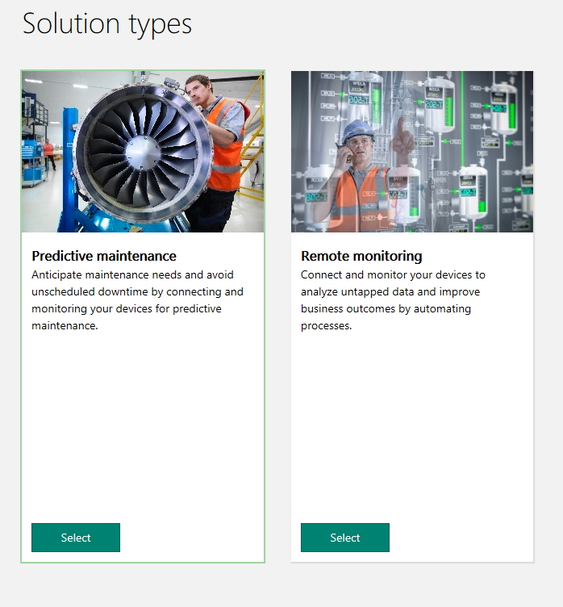
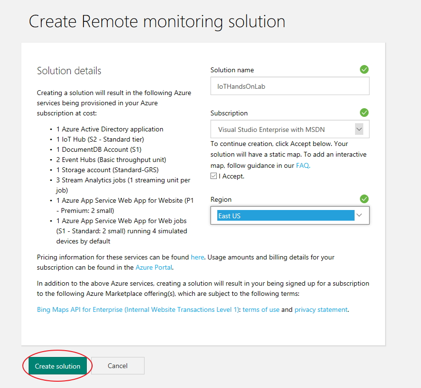
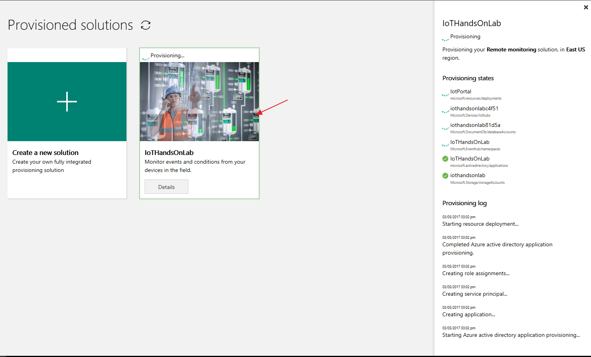
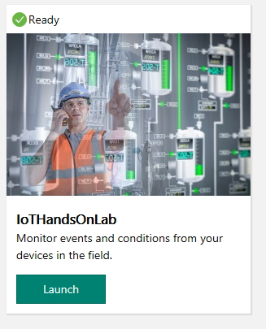
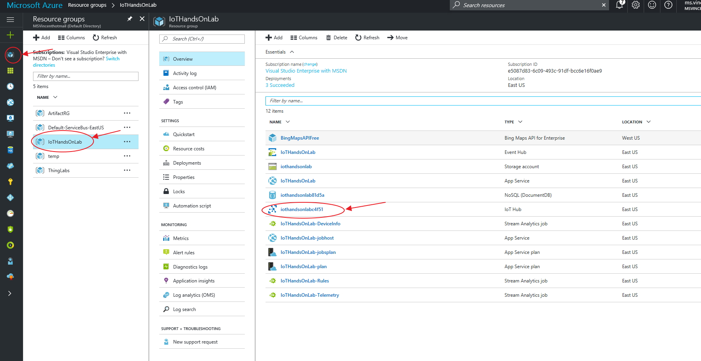
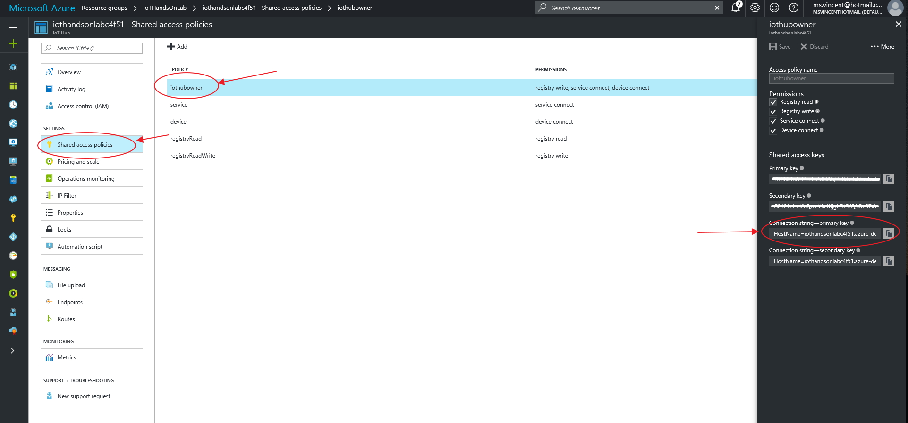
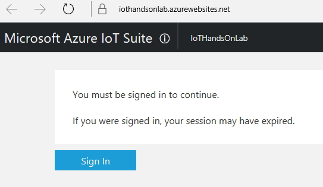
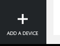
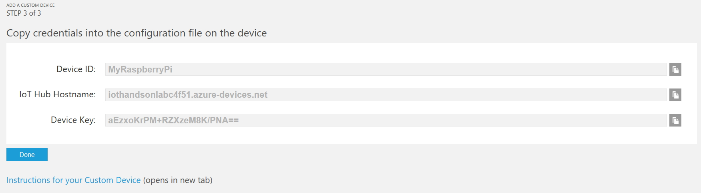

## Steps (Performed by students during HOL)


1. Setup your Azure IoT Suite remote monitoring pre-configured solution
  1. Go to the Microsoft IoT Suite microsite [https://www.azureiotsuite.com/](https://www.azureiotsuite.com/).
  1. Log in using your Azure subscription credentials. 
  1. Click the "Create a new solution" button. 
        <p align="center">
          
      </p>
  1. Select "Remote monitoring".
        <p align="center">
          
      </p>
  1. Fill out the form to create a Remote monitoring solution
    - Enter a name for your remote monitoring solution eg. IoTHandsOnLab-VinnyH. Note that the solution name needs to be globally unique. Once you provide a unique name, a green checkmark will appear to indicate that the solution name is valid. 
    - Choose the subscription that you will be using eg. Visual Studio Enterprise with MSDN
    - Click "I Accept" 
    - Select the closest region to deploy your remote monitoring solution eg. East US
    - Click "Create solution". The remote monitoring solution will get provisioned to your Azure subscription in approximately 5 minutes. 
       <p align="center">
          
      </p>
   1. While the remote monitoring solution is being provisioned, you can see the provisioning state and logging information by clicking on the solution 
      <p align="center">
          
      </p>
   1. Once the solution is fully provisioned, it will appear in your list of provisioned solutions showing the "Ready" indicator with a green checkmark. While the solution is being created, we will continue to follow the steps below. 
      <p align="center">
          
      </p>

## (Optional) Enabling Interactive Bing Maps in the Pre-configured Solution 

The new version of the remote monitoring pre-configured solution comes with a static Bing map image configured by default. For this hands on lab, we won't be making use of the interactive maps but if interested, instructions on how to enable it is available [here](/OptionalLabs/DynamicMaps.md)


## Obtain Your IoT Hub Primary Key and Connection String
1. Open the [Azure Portal](https://portal.azure.com/) tab and navigate to your IoT Hub service that you deployed as part of the remote monitoring solution
  - Click the *resource group* icon -> click the name of your remote monitoring solution -> click the IoT Hub service that was created when you provisioned the remote monitoring solution. 
      <p align="center">
          
      </p>
1. Obtain the "Connection string - primary key" for your IoT Hub. 
  - Click on the "Shared access policies".
  - Click on the "iothubowner" policy.
  - Copy the primary key connection string. Save the primary key connection string in notepad for later.
      <p align="center">
          
      </p>

## Create Your Device in the Remote Monitoring Pre-configured Solution 
1. Go back to the Azure IoT Suite microsite tab. Click the "Launch" button on the newly provisioned remote monitoring solution. This will open up a new browser tab to your remote monitoring solution dashboard.
      <p align="center">
          
      </p>
1. Click the "Sign In" button.
      <p align="center">
          
      </p>
1. If the following page requires you to accept the terms and conditions, click "I Agree". 
1. You will now have access to your created remote monitoring preconfigured solution. Feel free to browse around and review the features available in the pre-configured solution. 
      <p align="center">
          
      </p>

1. Open the Remote Monitoring Pre-configured Solution tab
1. At the bottom left of the portal, click the "+ Add A Device" button. 
      <p align="center">
          
      </p>
1. On the "Step 1 of 3" page, click "Add New" to add in a custom device. 
      <p align="center">
          
      </p>
1. On the "Step 2 of 3" page, click the "Let me define my own Device ID" radio button. Enter in a device ID eg. MyRaspberryPi. Click on the "Check ID" button to ensure that your device ID is unique. If the Device ID is unique, the text "Device ID is available" in green text will appear. Click the "Create" button. 
      <p align="center">
          
      </p>
1. The "Step 3 of 3" page provides you the *Device ID*, *IoT Hub Hostname* and *Device Key* that you will need to connect your Raspberry Pi to the remote monitoring solution. Copy and paste the value of these fields in a text document somewhere. 
      <p align="center">
          
      </p>
      
## Connect Your Raspberry Pi to the Remote Monitoring Pre-configured Solution

1. Configure the Raspberry Pi to send messages to the IoT Hub.
  1. Copy the [Python code](https://github.com/khilscher/IoTHubPiHackathon/blob/master/SenseHat_IoTHub_Http_Lab.py) from this HOL to a file. Save the file as ```SenseHat_IoTHub_Http_Lab.py``` and open it with a text editor such as Notepad.
  1. Alternatively you can download the file directly to your Raspberry Pi using: ```git clone https://github.com/khilscher/IoTHubPiHackathon.git``` and edit the ```SenseHat_IoTHub_Http_Lab.py``` using a text editor such as Nano.
  1. Next, you will provide the information required to connect the Raspberry Pi to the IoT pre-configured solution:
  - Update the file with the primary key connection string. Look for ```connectionString =``` and paste in the primary key connection string you copied earlier. 
  - Search for ```deviceId =``` and paste in the Device ID you created earlier.
  1. Copy ```SenseHat_IoTHub_Http_Lab.py``` to your Raspberry Pi using PuTTY. 
  - If you installed PuTTY using the default settings, the PuTTY environment variables should be set in your PATH already. Otherwise, the pscp executable will be in your PuTTY directory.<br/>
Open up a command prompt and enter the following command to copy the python script to your Raspberry Pi. If you didn't change the username/password, it should be pi/raspberry <br/>
`pscp SenseHat_IoTHub_Http_Lab.py userid@server_name:/path/SenseHat_IoTHub_Http_Lab.py`
  1. Log into the Raspberry Pi using PuTTY.
  1. Verify that the file was transfered by listing the directory: `ls -l`
  
  
  
  1. Start sending messages by invoking the script in Python
      ```
      pi@raspberrypi:~ $ python SenseHat_IoTHub_Http_Lab.py
      ```
  1. On your laptop, open Device Explorer, click the Data tab, select your device from the Device ID list, and click *Monitor*. If you see messages arriving then Congratulations, your Raspberry Pi is now sending data to Azure IoT Hub. 
  
  
  
1. Referring to the [Sense Hat API](https://pythonhosted.org/sense-hat/api/), update the code to send other telemetry to IoT Hub from the Sense HAT. 
  1. Update the ```SenseHat_IoTHub_Http_Lab.py``` code to send multiple telemetry data points (e.g. Yaw, Pitch, Roll, or Temperature, Pressure, Humidity) in a single JSON-formatted message to IoT Hub. See [sample_payload.json] (sample_payload.json). Solution source code - Authorized MSFT personnel only [SenseHat_IoTHub_Http_JSON.py](https://kevinhilscher.visualstudio.com/_git/IoT%20Hackathon?path=%2FSenseHat_IoTHub_Http_JSON.py&version=GBmaster&_a=contents).
  1. Update ```SenseHat_IoTHub_Http_Lab.py``` to display the HTTP response code from the IoT Hub message onto the Sense HAT LED display. Solution source code - Authorized MSFT personnel only [SenseHat_IoTHub_Http_JSON_LED.py](https://kevinhilscher.visualstudio.com/_git/IoT%20Hackathon?path=%2FSenseHat_IoTHub_Http_JSON%20_LED.py&version=GBmaster&_a=contents).
1. To send messages from IoT Hub back to your Raspberry Pi:
  1. Copy the ```SenseHat_IoTHub_Http_C2D_LED.py``` file to your Raspberry Pi using pscp or download it directly using git clone.
  1. Update the file with the primary key connection string. Look for ```connectionString =``` and paste in the primary key connection string you copied earlier. Then look for ```deviceId =``` and paste in the Device Name you created earlier. Save the file.
  1. Run the file using ```pi@raspberrypi:~ $ python SenseHat_IoTHub_Http_C2D_LED.py```
  
  
  
  1. On your laptop, open Device Explorer, click the Messages to Device tab, select your device from the Device ID list, type in a message into the Message textbox and click Send. 
  
   
  
  1. On your Sense HAT, you should see the message appear on the display.
  


## Using the Python Device SDK
IoT Hub also supports MQTT and AMQP protocols. These are generally more efficient and scale better than using the HTTP REST API. In order to use MQTT or AMQP with Python, you will need to download and compile the Python Device SDK on your Raspian operating system.

The full instructions are [here] (https://github.com/Azure/azure-iot-sdk-python/blob/master/doc/python-devbox-setup.md) with some Python SDK examples [here] (https://github.com/Azure/azure-iot-sdk-python/tree/master/device/samples).

In summary:
- ```git clone --recursive https://github.com/Azure/azure-iot-sdk-python.git```
- ```cd azure-iot-sdk-python/build_all/linux```
- ```sudo ./setup.sh```
- ```sudo ./build.sh```

After a successful build, the ```iothub_client.so``` Python extension module is copied to the device/samples and service/samples folders. The iothub_client.so must be in the same folder as your IoT Hub client python script or in the common shared libraries folder such as ```/usr/local/lib``` or ```/usr/lib```.
