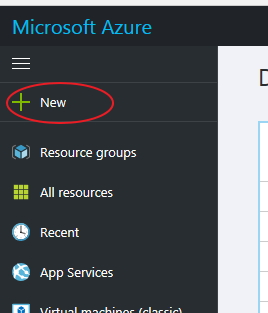
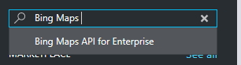
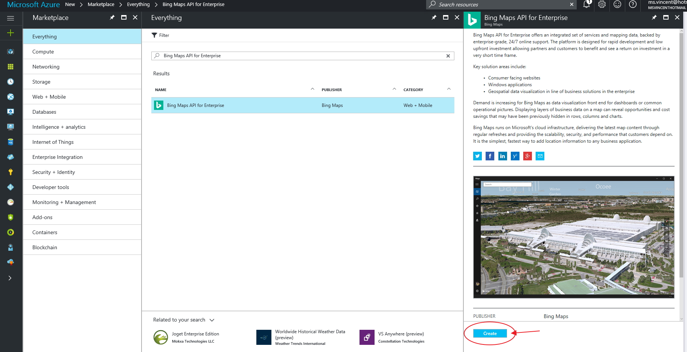
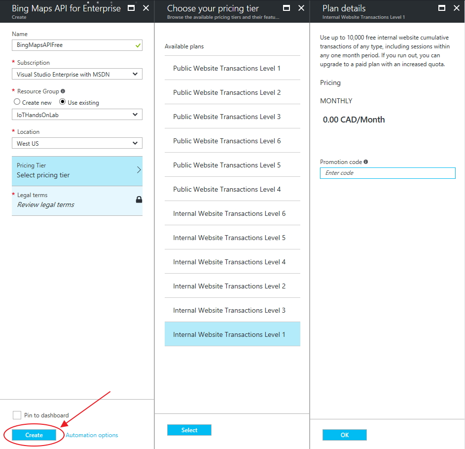
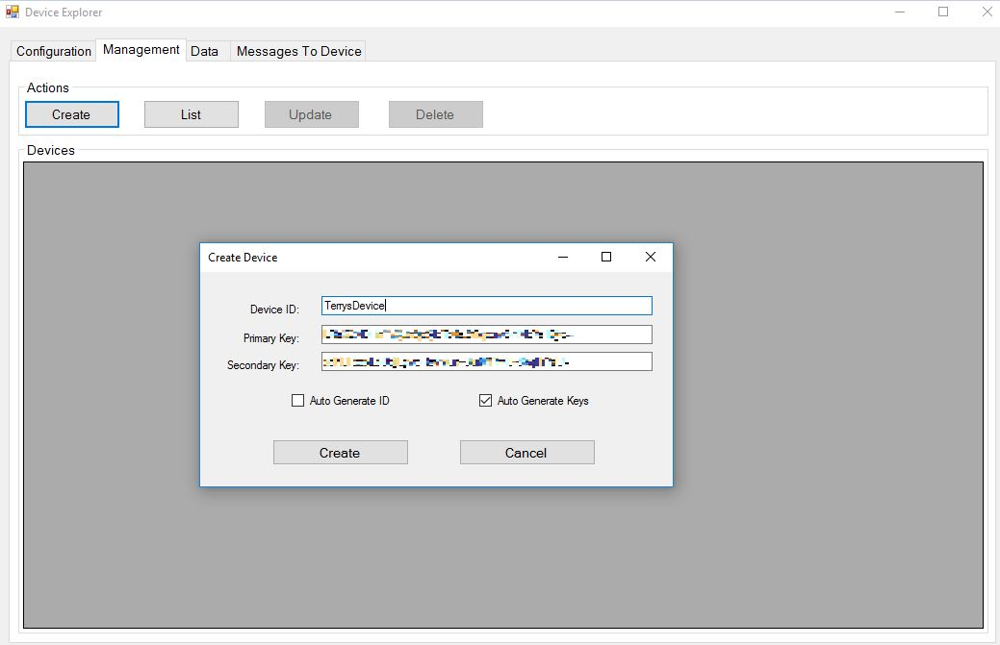

# IoT Hub Pi Hands on Lab (HoL)

## Overview
This Hands on Lab (HOL) demonstrates connecting a Raspberry Pi running Raspian to [Azure IoT Hub] (https://azure.microsoft.com/en-us/services/iot-hub/) and sending telemetry to Azure IoT Hub from either:
- a physical [Sense HAT](https://www.raspberrypi.org/products/sense-hat/) connected to the Raspberry Pi; or
- a [Sense HAT Emulator](https://www.raspberrypi.org/blog/sense-hat-emulator/) installed on the Raspberry Pi.

Completing this HOL will provide you with the basic skills needed to connect and securely send telemetry from a physical device (e.g. a field device or field gateway) to the Azure IoT Hub. This HOL does not demonstrate what can be done with the data after it arrives at the Azure IoT Hub. Having said that, you can do almost anything including complex event processing, stream processing, saving telemetry to blob storage or databases, analytics, training of Machine Learning models etc.

### Why Sense HAT?
We didn't want you to mess around with breadboards, jumper cables, resistors etc. This just wastes time and adds nothing to the goal of connecting a sensor to Azure IoT Hub. The Sense HAT has all the necessary components installed on the circuit board, including a ready to use library, and a series of sensors to play with.

### Why HTTPS and REST?
For simplicity and to avoid downloading/compiling SDKs during the HOL, we chose to send the Sense Hat telemetry to Azure IoT Hub using the [IoT Hub REST API](https://docs.microsoft.com/en-us/rest/api/iothub/) over HTTPS. Of course, you can use one of the many device SDKs available, which support sending messages over AMQP and MQTT. If you want to use the device SDKs, refer to the Using the .NET Device SDK section below.

## Requirements
- [Raspberry Pi 3 Model B](https://www.raspberrypi.org/products/raspberry-pi-3-model-b/) (Pi 2 Model B with USB Wi-Fi dongle will probably work as well) with latest version of Raspian installed on the micro SD card. Using [NOOBS](https://www.raspberrypi.org/downloads/noobs/) works fine. 
- [Sense HAT Emulator](https://www.raspberrypi.org/blog/sense-hat-emulator/) (which comes with the Raspian O/S)
- [Sense HAT](https://www.raspberrypi.org/products/sense-hat/) (optional - for those that want to play with real hardware). You can order the Sense HAT from a variety of online sites such as adafruit.com, amazon.com etc. Please order yours 3-4 weeks in advance of the HOL so it will arrive in time.
- Laptop (running whatever operating system you desire) but ideally running Windows so you can install/run [Device Explorer](https://github.com/Azure/azure-iot-sdks/releases/download/2016-11-17/SetupDeviceExplorer.msi). 
- [PuTTY] (http://www.chiark.greenend.org.uk/~sgtatham/putty/latest.html) or another SSH client.
- An Azure subscription. You can create a [free trial](https://azure.microsoft.com/en-us/free/?b=17.01) Azure subscription, or you can use an MSDN Azure subscription or a subscription from your company. 
- A basic understanding of Python and Linux.
- TBD

## Advance Setup (Must be completed in advance of the HOL)
Please perform the following steps in advance of the HOL otherwise you will waste the entire HOL performing these steps.
- Ensure your Raspberry Pi can boot [Raspian] (https://www.raspberrypi.org/downloads/) from the SD card.
  1. Install the operating system installer [NOOBS] (https://www.raspberrypi.org/downloads/noobs/) 
  1. Format the microSD card that you will use for your Raspberry Pi. 
  1. Extract the files in the NOOBs zip file. 
  1. Copy the extracted files onto the formatted microSD card such that the files are at the root directory of the microSD card. 
  1. Insert the microSD card into your Pi and connect the power supply. 
  1. Click to install Raspbian
     <p align="center">
        
      </p>
  1. Confirm the deletion of content on the SD card and the installation of the OS. 
      <p align="center">
        
      </p>
- Ensure Sense HAT Emulator is installed (by default it is installed with Raspian). Verify by checking under 'Programming' in the Raspian GUI.
      <p align="center">
        
      </p>
- Install [Device Explorer](https://github.com/Azure/azure-iot-sdks/releases/download/2016-11-17/SetupDeviceExplorer.msi) on your Windows laptop. Device Explorer is a great tool that can be used to perform operations such as manage the devices registered to an IoT hub, view device-to-cloud messages sent to an IoT hub, and send cloud-to-device messages from an IoT hub. 
- Ensure your Azure subscription login is working and you have sufficient permissions to create resources.
- Download and install [PuTTY](http://www.chiark.greenend.org.uk/~sgtatham/putty/latest.html).

## Steps (Performed by students during HOL)
1. Connect to Wifi.
  1. Connect your Raspberry Pi to a monitor.
  1. Click on the wifi icon in the top right.
      <p align="center">
        
      </p>
  1. Enter the correct wifi credentials
1. Retrieve the ip address.
  1. Click on the command prompt
      <p align="center">
         
      </p>
  1. Retrieve the ip address with the following command: `ifconfig` <br/>
     Take note of the ip address. 
1. Disconnect from the monitor.
1. Using your laptop, verify you connection by connecting to the Rasberry Pi using PuTTY.
1. Setup your Azure IoT Suite remote monitoring pre-configured solution
  1. Go to the Microsoft IoT Suite microsite [https://www.azureiotsuite.com/](https://www.azureiotsuite.com/).
  1. Log in using your Azure subscription credentials. 
  1. Click the "Create a new solution" button. 
        <p align="center">
          
      </p>
  1. Select "Remote monitoring".
        <p align="center">
          
      </p>
  1. Fill out the form to create a Remote monitoring solution
    - Enter a name for your remote monitoring solution eg. IoTHandsOnLab-VinnyH. Note that the solution name needs to be globally unique. Once you provide a unique name, a green checkmark will appear to indicate that the solution name is valid. 
    - Choose the subscription that you will be using eg. Visual Studio Enterprise with MSDN
    - Click "I Accept" 
    - Select the closest region to deploy your remote monitoring solution eg. East US
    - Click "Create solution". The remote monitoring solution will get provisioned to your Azure subscription in approximately 5 minutes. 
       <p align="center">
          
      </p>
   1. While the remote monitoring solution is being provisioned, you can see the provisioning state and logging information by clicking on the solution 
      <p align="center">
          
      </p>
   1. Once the solution is fully provisioned, it will appear in your list of provisioned solutions showing the "Ready" indicator with a green checkmark. While the solution is being created, we will continue to follow the steps below. 
      <p align="center">
          
      </p>

**Dynamic Maps **

The new version of the remote monitoring pre-configured solution comes with a static map image configured by default. For this hands on lab, we will re-configure the solution to show dynamic Bing maps. 
1. Login to the Azure Portal using your subscription credentials [https://portal.azure.com/] (https://portal.azure.com/)
1. On the Azure Portal, click the "+ New" Button.
      <p align="center">
          
      </p>
1. In the search bar, type in "Bing Maps". Click the "Bing Maps API for Enterprise" service when it appears.
 <p align="center">
          
      </p>
1. Select the "Bing Maps API for Enterprise" service. In the "Bings Maps for Enterprise" blade, click the "Create" button. 
 <p align="center">
          
      </p>
  - Give your Bing Maps API for Enterprise Service a name. eg. StudentName-BingMaps
  - Choose your subscription from the *Subscription* drop down box. 
  - Use the existing *Resource Group* that was created for your remote monitoring pre-configured solution. 
  - Select the "Internal Website Transactions Level 1" plan. Click OK. 
  - Review the "Lgeal terms". Click the "I give Microsoft permissions to share ... and related products" check box. Click the "Purchase" button. 
  - On the *Bing maps API for Enterprise* blade, click "Create"
   <p align="center">
          
      </p>
  

      
1. Click the "Launch" button to open up a browser tab to your newly provisioned remote monitoring solution. The 
1. Click the "Sign In" button.
1. If the following page requires you to accept the terms and conditions, click "I Agree". 
1. 


-------- Steps using IoT Hub only -----
1. Setup your Azure IoT Hub.  
  1. Go to the [Azure Portal](https://portal.azure.com).
  1. Select the [IoT Hub Service](https://ms.portal.azure.com/#blade/HubsExtension/Resources/resourceType/Microsoft.Devices%2FIotHubs). 
  1. Click on "Add".
  1. Enter the properties for your IoT Hub.
    1. Enter a name for your hub.  eg. TerrysFirstIoTHub
    1. Choose the "Free" pricing tier.  This will allow you up to 5,000 messages per day.
    1. For the Free tier, the "IoT Hub units" will default to 1.
    1. If you have more than 1 subscription, choose the one you wish to use.
    1. Create a new Resource group for your hub.  It can have the same name as the IoT Hub.
    1. Select the "West US" Location.
    1. Click the "Pin to dashboard" button.
    1. Click the "Create" button.
1. Wait for the hub to be created.  You will be notified in the "Notifications" section when it is complete.  
      <p align="center">
         
      </p>
1. Create (configure) your device in Azure IoT Hub.
  1. Click on your new IoT Hub in the [Azure Portal](https://portal.azure.com) Dashboard.
  1. Click on the "Shared access policies".
  1. Click on the "iothubowner" policy.
  1. Copy the primary key connection string. Save the primary key connection string for later.
      <p align="center">
         
      </p>
  1. Open Device Explorer
  1. In the "Connection information" tab paste the primary key connection string into the "IoT Hub Connection String" text box.
  1. Click on "Update".
  1. Click on the "Management" tab.
  1. In the "Actions" section, select "Create".
  1. Enter a name for your device. Save the device name for later.
      <p align="center">
         
      </p>
  1. Click "Create".
1. Configure the Raspberry Pi to send messages to the IoT Hub.
  1. Copy the [Python code](https://github.com/khilscher/IoTHubPiHackathon/blob/master/SenseHat_IoTHub_Http.py) from this HOL to a file. Save the file as ```SenseHat_IoTHub_Http.py``` and open it with a text editor such as Notepad.
    1. Alternatively you can download the file directly to your Raspberry Pi using: ```git clone https://github.com/khilscher/IoTHubPiHackathon.git``` and edit the ```SenseHat_IoTHub_Http.py``` using a text editor such as Nano.
  1. Update the file with the primary key connection string. Look for ```connectionString =``` and paste in the primary key connection string you copied earlier. Then look for ```deviceId =``` and paste in the Device Name you created earlier.
  1. Copy ```SenseHat_IoTHub_Http.py``` to your Raspberry Pi using PuTTY.  The pscp executable will be in your PuTTY directory.<br/>
`pscp SenseHat_IoTHub_Http.py userid@server_name:/path/SenseHat_IoTHub_Http.py`
  1. Log into the Raspberry Pi using PuTTY.
  1. Verify that the file was transfered by listing the directory: `ls -l`
  1. Start sending messages by invoking the script in Python
      ```
      pi@raspberrypi:~ $ python SenseHat_IoTHub_Http.py
      ```
  1. On your laptop, open Device Explorer, click the Data tab, select your device from the Device ID list, and click Monitor. If you see messages arriving then Congratulations, your Raspberry Pi is now sending data to Azure IoT Hub. 
1. Referring to the [Sense Hat API](https://pythonhosted.org/sense-hat/api/), update the code to send other telemetry to IoT Hub from the Sense HAT. 
  1. Update the ```SenseHat_IoTHub_Http.py``` code to send multiple telemetry data points (e.g. Yaw, Pitch, Roll, or Temperature, Pressure, Humidity) in a single JSON-formatted message to IoT Hub. See [sample_payload.json] (sample_payload.json). Solution source code - Authorized MSFT personnel only [SenseHat_IoTHub_Http_JSON.py](https://kevinhilscher.visualstudio.com/_git/IoT%20Hackathon?path=%2FSenseHat_IoTHub_Http_JSON.py&version=GBmaster&_a=contents).
  1. Update ```SenseHat_IoTHub_Http.py``` to display the HTTP response code from the IoT Hub message onto the Sense HAT LED display. Solution source code - Authorized MSFT personnel only [SenseHat_IoTHub_Http_JSON_LED.py](https://kevinhilscher.visualstudio.com/_git/IoT%20Hackathon?path=%2FSenseHat_IoTHub_Http_JSON%20_LED.py&version=GBmaster&_a=contents).
1. To send messages from IoT Hub back to your Raspberry Pi:
  1. Copy the ```SenseHat_IoTHub_Http_C2D_LED.py``` file to your Raspberry Pi using pscp or download it directly using git clone.
  1. Update the file with the primary key connection string. Look for ```connectionString =``` and paste in the primary key connection string you copied earlier. Then look for ```deviceId =``` and paste in the Device Name you created earlier. Save the file.
  1. Run the file using ```pi@raspberrypi:~ $ python SenseHat_IoTHub_Http_C2D_LED.py```
  1. On your laptop, open Device Explorer, click the Messages to Device tab, select your device from the Device ID list, type in a message into the Message textbox and click Send. You should see the message appear on the Sense HAT LED display.

## Using the Python Device SDK
IoT Hub also supports MQTT and AMQP protocols. These are generally more efficient and scale better than using the HTTP REST API. In order to use MQTT or AMQP with Python, you will need to download and compile the Python Device SDK on your Raspian operating system.

The full instructions are [here] (https://github.com/Azure/azure-iot-sdk-python/blob/master/doc/python-devbox-setup.md) with some Python SDK examples [here] (https://github.com/Azure/azure-iot-sdk-python/tree/master/device/samples).

In summary:
- ```git clone --recursive https://github.com/Azure/azure-iot-sdk-python.git```
- ```cd azure-iot-sdk-python/build_all/linux```
- ```sudo ./setup.sh```
- ```sudo ./build.sh```

After a successful build, the ```iothub_client.so``` Python extension module is copied to the device/samples and service/samples folders. The iothub_client.so must be in the same folder as your IoT Hub client python script or in the common shared libraries folder such as ```/usr/local/lib``` or ```/usr/lib```.
